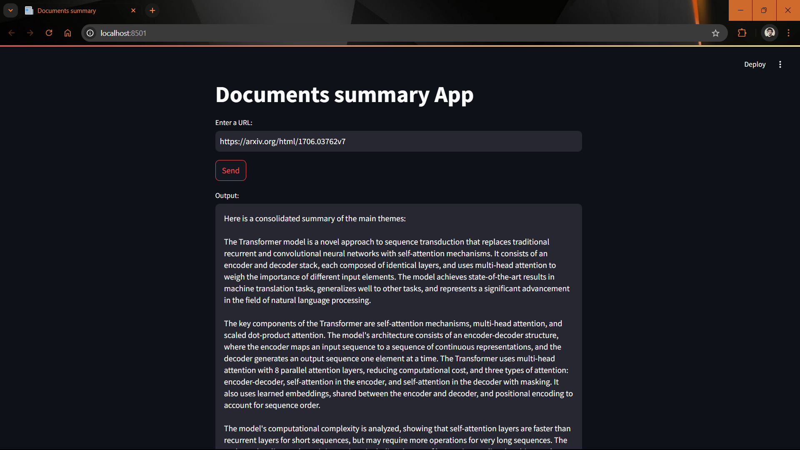

# Documents Summary App

A simple web application that summarizes documents from a given URL using advanced language processing techniques with LangChain and Groq. 
This app allows users to input a URL, fetch the content of the document, and generate concise summaries. 




## Features

- **URL Input**: Users can enter a URL to load documents.
- **Asynchronous Processing**: Summarization is done asynchronously for efficient handling of large documents.
- **Chunking and Collapsing**: The app intelligently splits documents into chunks, processes them, and combines summaries into a final summary.
- **Environment Configuration**: Uses environment variables for API key management.

## Requirements

- Python 3.7 or later
- Streamlit
- LangChain
- Groq API
- dotenv
- Other dependencies specified in `requirements.txt`

## Installation

1. Clone the repository:
   ```bash
   git clone https://github.com/vishnun0027/Documents-Summary-App.git
   cd Documents-Summary-App
   
2. Install the required packages:
   ```bash
   pip install -r requirements.txt

2. Create a .env file in the root directory and add your Groq API key:
   ```bash
   GROQ_API_KEY=your_api_key_here
   
## Usage   
1. Run the Streamlit app:
   ```bash
   streamlit run app.py

2. Open your browser and go to http://localhost:8501.

3. Enter the URL of the document you want to summarize and click on "Send" to generate the summary.

## Code Overview
### Main Components
- `app.py`: The main Streamlit application file that handles user input and displays the summary.
- `summarize.py`: Contains the logic for loading documents, generating summaries, and collapsing them if necessary.
- `loader.py`: Implements the load_and_split_docs function to load documents from a URL and split them into manageable chunks.
- `llm.py`: Sets up the language model with the Groq API for generating summaries.
- `utils.py`: Contains utility functions for mapping and reducing summaries.

